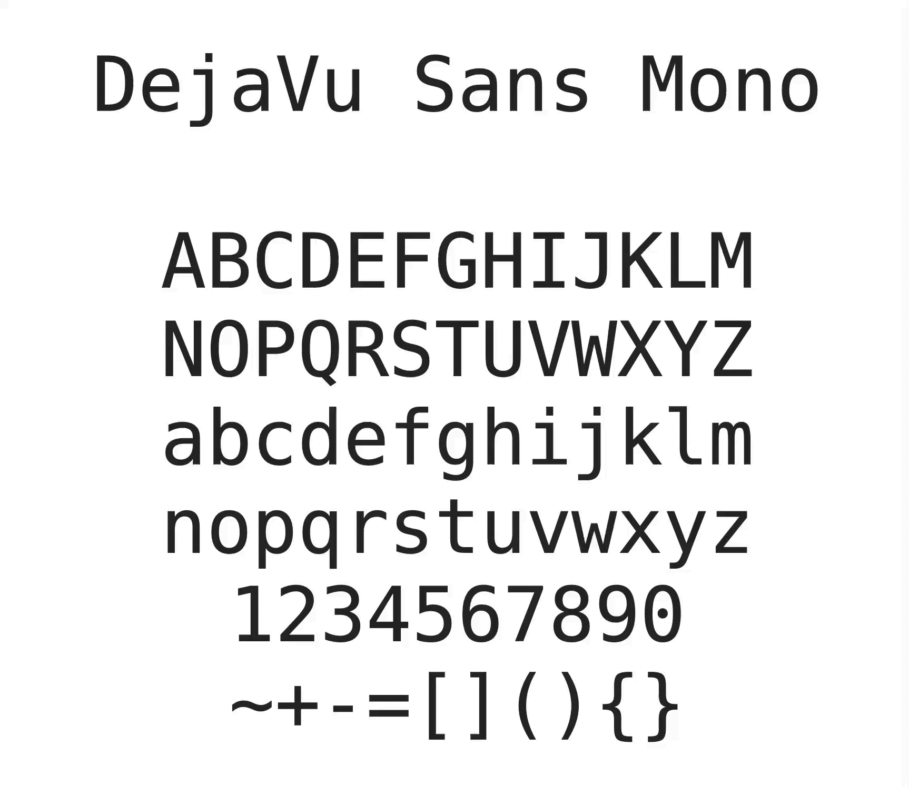

# Brutalist Mono

Brutalist Mono is a very simple modification on top of [DejaVu Sans Mono](https://github.com/dejavu-fonts/dejavu-fonts) (yes, _another one_), making it more suitable for coding. The changes are very nitpicky and you can probably just move along.

Comparison to DejaVu Sans Mono:

## Changes from DejaVu Sans Mono

v1.0:

* `r` – offset to the left
* `_` – increase height, reduce width
* `-` (minus) – make wider
* `0` – slashed instead of dotted

v1.1:

* `l` – increase upper arm and recenter
* `i` and `j` – increase dot sizes, making them square

v1.2:

* `l` – drop foot below the baseline
* `C` – flatter terminals
* `G` – flatter top terminal
* `J` – flatter bottom terminal
* `S` – flatter terminals
* `a` – flatter top terminal
* `c` – flatter terminals
* `e` – flatter bottom terminal
* `g` – flatter bottom terminal
* `r` – flatter top terminal
* `s` – flatter terminals
* `2` – flatter top terminal
* `3` – flatter terminals
* `5` – flatter bottom terminal and mid stroke
* `6` – flatter top terminal
* `9` – flatter bottom terminal
* `$` – flatter terminals

v2.0:

* `C` – slightly rounder shape
* `G` – more even upper terminal
* `S` – more even terminals
* `c` – more even terminals
* `l` – more pedantic bottom
* `r` – wider right terminal
* `s` – more even terminals
* `9` – more even lower terminal
* `g` – more even lower terminal
* `J` – clean up lower terminal
* `~` – blatantly stolen from Hack
* `t` – make bottom curved the same as `l`
* `j` – make bottom curved the same as `l`
* `[` – make wider, match `lparen`'s width
* `]` – make wider, match `rparen`'s width
* `5` – more even bottom terminal, add back the "spike" in the middle
* `y` – curved bottom terminal
* `$` – more even terminals

v2.1:

* `,`, `.`, `;`, `:`, `!`, `?` – use rounded dots and commas (adapted from Hack)
* `*` – use Menlo variant
* `l` – clean up bottom curve a little bit

## Motivation

Another DejaVu/Vera Mono clone? Yes. But this one is opinionated:

1. I don't care about "readability on small font sizes". Make your font larger and/or get a decent monitor. It's the 21st century.
2. I don't care about font hinting. Modern monitors are high-DPI.
    * Note: The native renderer on Windows seems to require manual hinting instructions to be added even when rendering at high DPI screens. I will not be adding this. Therefore, this font looks terrible on Windows, unless you're using an Electron app (VS Code, Atom, etc). They're using a custom renderer and render correctly.
3. I don't care about `O0`, `lI1|`, or any of that crap. It's fine. See point #1.

If any of this bothers you, try [Hack](https://github.com/source-foundry/Hack). It's awesome. I made [my mod](https://github.com/BRUTALISM/Hack) available as well.

### Why not Hack?

Hack is great, but has way too many unnecessary modifications on top of the baseline DejaVu Sans Mono. To name a few:

* the parentheses are unnecessarily spread out in earlier versions, and too rounded in newer ones
* the `1` has an awkward downward facing arm
* contributing is complicated if you're only using plain old FontForge (I don't want to shell out EUR 250 for Glyphs.app)
* [alt-hack](https://github.com/source-foundry/alt-hack) is great but I ended up just using it to revert most mods back to the original DejaVu style, so I figured why bother?

### Why not Menlo?

* the uppercase `N` is hideously wide (once you see it, you can not unsee it)
* punctuation is unnecessarily exaggerated
* there are [many weird tweaks](http://leancrew.com/all-this/2009/10/the-compleat-menlovera-sans-comparison/) done to it (relative to its parent Bitstream Vera Sans Mono) to make it render better on ancient Mac OS versions with low-DPI monitors, which disqualifies it immediately (see point #1 in "Motivation" above)

### Why not DejaVu Sans Mono?

This typeface is almost perfect for programming&dagger;, except:

* the underscore is ridiculously thin, making it visually odd when reading `THINGS_WITH_MANY_UNDERSCORES` and esoteric C/C++ identifiers with `__multiple__underscores__`
* the lowercase `r` is offset a bit to the right (Hack has got this right – once you see it, you can not unsee it)
* the `-` glyph is ridiculously narrow
* other nitpicky stuff you really don't care about but I do

&dagger; – [Source Code Pro](https://github.com/adobe-fonts/source-code-pro) is still the king, and I don't dare [come at the king](https://www.youtube.com/watch?v=py1WDlaIr9A).

## Building

Short version:

* Edit the .sdf files with FontForge (if you want to mod)
* `make`
* observe the `build` folder

This will probably fail, so: [long version](BUILDING.md).

## Contributing

If you really convince me.

## License

Same as DejaVu fonts, see [LICENSE](LICENSE).